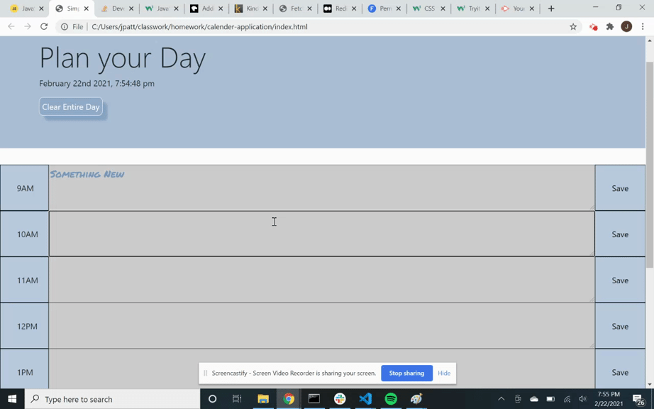
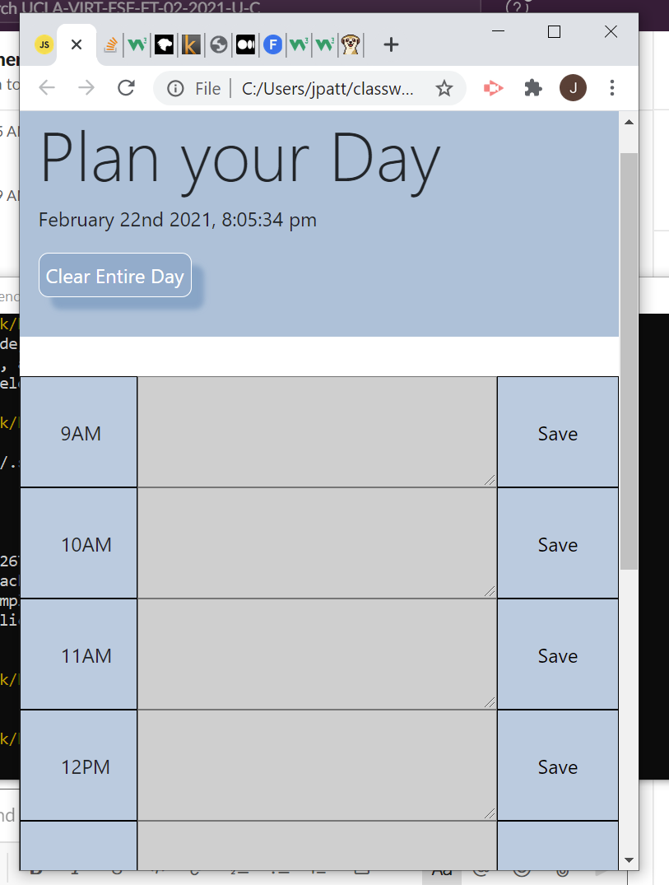

# calender-application
This is a very simple nine to five calendar application for logging events for the day.

# 9-5 Daily Planner
Nine to Five Daily Planner

Link to deployed webpage 

link to repository

# Jeffery William Patterson

### My webpage can accomplish the list of things below.

1. The top banner provides the user with a title and the current date and time that they will use the nine to five planner.
    A. Within the banner is a clear all button. This button will allow the user to clear all tasks and events that have been scheduled. Placed at the top so when the page is loaded at the beginning of their day they can clear page and start new day.
        I. 
***
2. When the user enters text and clicks save. The text/task they input will stay even if they refresh the page.
    A: 
***
3. When the user clicks on the time button, the tasks inputted and saved will be cleared ONLY in the specific time slot. Time button also has a tooltip to let the user know that it serves a secondary purpose other than displaying the time.
    A: 
***
4. When a user views the page, past hours will be greyed, current hour will be red, and future hours will be green.
    A: This function works but is only viewable during the hours nine-five. I finished this readme after hours and the project is due soon however from the videos above you can see all hours are grey.
***
5. The window can be any size and all elements within will adjust and fit properly.
    A: 
